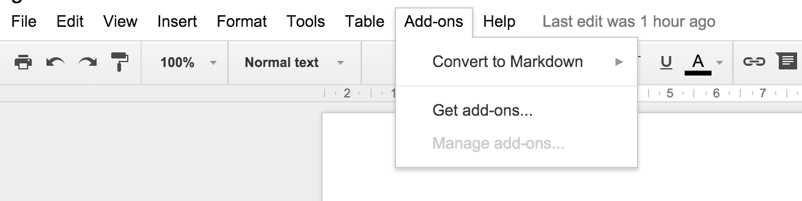
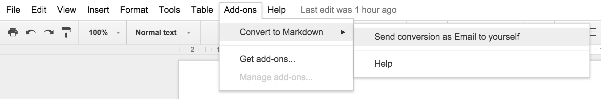

# gdoc2md-addon
Convert Google Docs to Markdown

## Installation

Install this add-on from the [Google Web Store]().

## Usage

Open Google Docs and the add-on should be available from the `Add-ons` menu.

Currently the add-on only supports emailing the resulting markdown and image files to the email for your Google account. Feel free to create a [Pull Request](pulls) with new export methods!

## Credits

[gdocs2md](https://github.com/mangini/gdocs2md) Google App Script was originally created by Renato Mangini.
